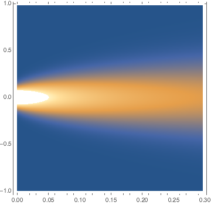

# PINN-example
This repo is a PyTorch realization of physics informed nerual network([PINN](https://github.com/maziarraissi/PINNs "physics informed neural networks")). I only did the first part of the original paper, that is, "continuous time data-driven solutions". The successful example is in "continuous_time_solver-heat_transfer" folder.

## Problem

I considered heat transfer problem in 1D. Initial temperature is gaussianly distribute spatially in range [-1, 1]. Its std is set to 0.1, that is,

,

The system evolve according to heat equation,

,

with periodic bundary condition,

.
And the time range I consider is [0, 0.3].

## Network structure and Training Details

The network takes  t and x as input and the output is temperature u(x,t). It hase 10 hidden full connection layer, with same width of 100. I choose softplus as activation functions, because ReLU is not smooth and tanh may suffer from gradient vanishing.

For loss design, the loss is a combination of equation of motion loss(EoM), boudary condition loss(BC) and initial condition loss(IC) (You can refer to the original paper for detail definitions.), with sample nums of 10000, 1000, 1000. Each part of input are resampled every epoch to prevent overfitting, so it is sort of a stochastic algorithm.

For optimizer, I use Adam with PyTorch's default settings, with no scheduler. I train the network for 100,000 epoch and it takes less than an hour for a 2080ti gpu. The final loss(EoM, BC, IC) is about 1-e6, and no larger than 1e-5.

For traditional numerical solution, I use simple iteration method for solving this PDE, 

where D is the differential operator. The spatial and temperal step is both 1e-5.

## Results

The PINN solves the PDE well enough, the mean L2 loss w.r.t the numerical solution is 7e-09. The following figure shows how good it fits: The blue surface is PINN's solution and the orange surface is numerical solution.

The following two figures are the heat maps of two method. The first is PINN's solution, and the second is numerical solution.

## Failure Examples

Before this successful examples, I have also tried with four failed examples. Here are their discriptions and my analysis.

- Double pendulum system solved with Lagrangian equation.
- Double pendulum system solved with Newton equation.
- Centeral gravity force system solved with Newton equation, in xy axis.
- Heat transfer system with discontinuous initial temperature.

All four faied examples cannot be optimized well. The minimum loss of each kind is at least 1e-3. 

For the first two examples, at first glance it may be caused by the chaotic nature of the system, but after I solve the system with RK4 method, the deviation starts at very begining, and the same case happened to the 3rd example. Now I think PINNs are not very suitable for ODEs, for (1)the initial condition loss is not strong enough to regularize the curve, and (2) f(t) in typical ODEs changes much more than in u(x,t) changes in typical PDEs (although the overall shape for PDEs also looks a lot different from beginning), the accumulated error may be much bigger than numerical solution.

I also retrain the PINN with restrain on the total energy to be unchange during the whole time ('first_integral' folder), and the result turns out to be good. Then I start to think about is it possible to use NN to find all independent first integral for an ODE system, or, with more restriction, a hamiltonian system, but currently I have no surprising results.

The 4th failed examples leads me to the success examples. It suggests my designed structure of PINN does not favor steep function change.

