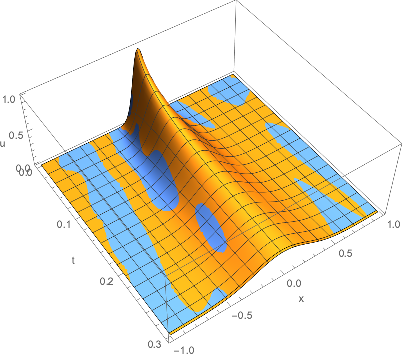

# PINN-example
This repo is a PyTorch realization of physics informed nerual network([PINN]([链接网址](https://github.com/maziarraissi/PINNs) "physics informed neural networks")). I only did the first part of the original paper, that is, "continuous time data-driven solutions". The successful example is in "continuous_time_solver-heat_transfer" folder.

## Problem

I considered heat transfer problem in 1D. Initial temperature is gaussianly distribute spatially in range [-1, 1]. Its std is set to 0.1, that is,

,

The system evolve according to heat equation,

,

with periodic bundary condition,

.
And the time range I consider is [0, 0.3].

## Network structure and Training Details

The network takes  t and x as input and the output is temperature u(x,t). It hase 10 hidden full connection layer, with same width of 100. I choose softplus as activation functions, because ReLU is not smooth and tanh may suffer from gradient vanishing.

For loss design, the loss is a combination of equation of motion loss(EoM), boudary condition loss(BC) and initial condition loss(IC) (You can refer to the original paper for detail definitions.), with sample nums of 10000, 1000, 1000. Each part of input are resampled every epoch to prevent overfitting, so it is sort of a stochastic algorithm.

For optimizer, I use Adam with PyTorch's default settings, with no scheduler. I train the network for 100,000 epoch and it takes less than an hour for a 2080ti gpu. The final loss(EoM, BC, IC) is about 1-e6, and no larger than 1e-5.

For traditional numerical solution, I use simple iteration method for solving this PDE, 

where D is the differential operator. The spatial and temperal step is both 1e-5.

## Results

The PINN produce good enough

## Failure Examples

